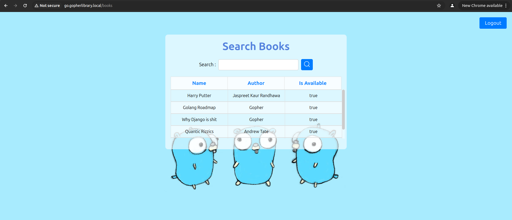
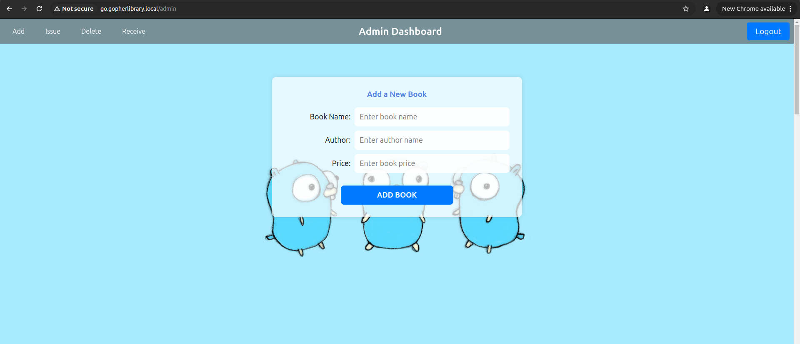

# <div align="center">Gopher Library</div>

## Description
This is a Library Management system built in Golang using the mvc architecture. The website consists of two seperate panels for student and admin. The user can see the existing books in the library and can also search for a specific book.




The admin can additionally perform these tasks:

- Add a book in the library

- Issue a book to a student

- Delete a book from library

- Receive a book from a student 





##  Local Setup

#### Go Project setup
- Run the following commands in terminal:
```bash
  go mod tidy
  go mod vendor
  cp config/example.env .env
``` 
Change the contents on .env according to the requirements specified inside


`Note: you need to have a same .env file inside the tests folder too for tests to work`


#### Mysql Setup

- Start your Mysql server and log into it, create a new database and then import the database from config/library_dump.sql using this command:

```bash
   mysql -u [username] -p [database_name] < library_dump.sql
```

#### Apache2 setup

- Install apache2 if not installed already

- Copy and paste the sample vhost file given in config/ to `/etc/apache2/sites-available` with the name `go.gopherlibrary.local.config`

- Now run these commands in the terminal:

```bash
sudo a2enmod proxy proxy_http
sudo a2ensite go.gopherlibrary.local
sudo a2dissite 000-default.conf
```
- add  `127.0.0.1	go.gopherlibrary.local` to `/etc/hosts`

Now finally, run these commands and the library website should be online at  `http://go.gopherlibrary.local`:
```
sudo systemctl restart apache2
go run main.go
```

## Version control

 **Migrate up** 
```bash
go run migrations/migrate.go up
```
 
 **Migrate down**
 ```bash
go run migrations/migrate.go down
 ```

**Create new migrations**
 ```bash
   migrate create -ext sql -dir migrations/ -seq init_mg
 ```
 In case of version error  -  ` fix manually sry`

 ## Testing

**Unit test for adding book** - 
```
go test  -v ./tests/add_test.go
```

